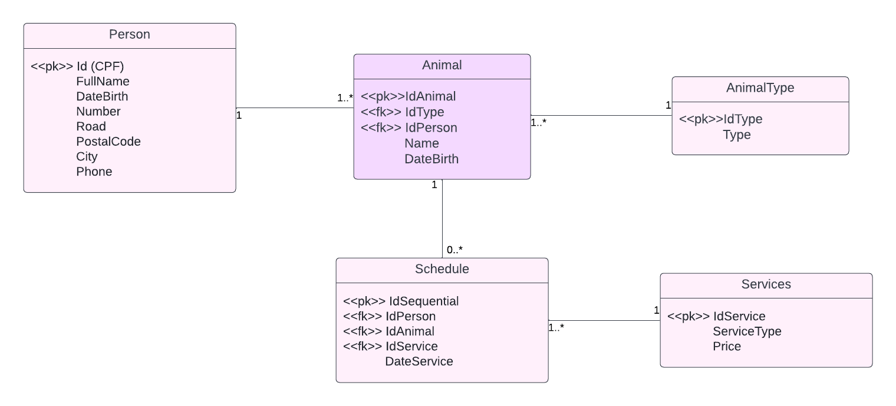

# 🐕‍🦺 Petlove

Trabalho 1 para a disciplina Banco de Dados I, com base no [desafio de backend do Petlove](https://github.com/petlove/vagas/tree/master/backend-ruby) e desenvolvido por [Beatriz Maia](https://github.com/beamaia) e [Sophie Dilhon](https://github.com/AHalic).

## 📜 Enunciado 
### Cenário: Você precisa escrever uma aplicação para gestão de animais.
- Pessoas tem animais, e animais tem tipos.
- Uma pessoa tem os atributos nome, documento (CPF), data de nascimento, endereço com número, rua, cidade e CEP e telefone.
- Um animal tem os atributos nome, dono, espécie, data de nascimento e ID único.
- Um tipo de animal tem os atributo nome e ID único.
- Um tipo de serviço tem os atributo nome e ID único.
- Um agendamento tem os atributos animal, dono, tipo de serviço, horário e ID único.

### Regras
- Pessoas podem ter vários animais.
- Animais só podem pertencer a uma pessoa.
- Pessoas devem ter entre 18 e 140 anos.
- CPFs são documentos únicos.
- Um horário só pode ser ocupado por um animal, indepentende do serviço.
- Um serviço e um tipo de Animal devem ter o nome seguindo o regex '[A-Z] + [a-z ]*'.
- Datas devem seguir o padrão YYYY-MM-DD, e caso seja a data de um agendamento, deve ainda possuir o horário como H:M.

## ⚙️ Configurando o ambiente

Para executar o projeto, você precisa de docker-engine versão 20.10.17 e docker-compose versão 3.8 no mínimo. Você também precisará de um arquivo .env com as seguintes variáveis:

```sh
DB_NAME
DB_PASS
DB_USER
```

Atualmente, o entrypoint no dockerfile é o init.sh, que executa o código para preencher o banco postgres e roda o script npm test. Para executar o projeto, deve-se utilizar o comando:

```sh
docker-compose up
```

É importante que você execute este comando dentro do repositório do projeto.


## 📊 Modelo conceitual

O problema foi modelado com 3 entidades que possuem relacionamento entre si. A imagem abaixo representa o modelo conceitual inicial. 


Com isso, foram criadas 5 tabelas: Person, Animal, Schedule, AnimalType e Service.




# Agradecimentos
Para se familiarizar com o docker image, utilizamos [docker-compose-postgres-template](https://github.com/alexeagleson/docker-node-postgres-template) by [alexeagleson](https://github.com/alexeagleson). O repositório ajudou bastante para entender um pouco sobre Docker e Docker-compose.
